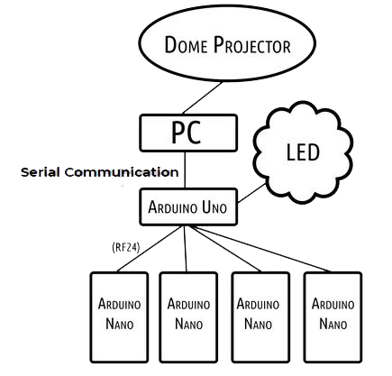

# Dome Project
This is a project done under Design & Innovation Project (IM3080). 
Contributors to this project: 
1. CHENG KUAN YONG, JASON
2. MOHAMED NIJAMUDEEN BIN PEER MOHAMED
3. GOH XINYING, CLARICE
4. HO CHUN KIT GLEN
5. JOANNA LIM JIA YI
6. CHIA XIAN DE BRENDAN
7. NG YE DONG
8. NG CHEONG SIAN
9. HAN XIHAO

## About

The project objective is to create an immersive and interactive experience using projection onto a dome ceiling.
It uses unity to animate and display images onto the dome. A Raspberry Pi is used as an intermediary for I/O interactions
to peripherals like LED strips and various sensors and buttons to add more interactivity to the dome experience.
